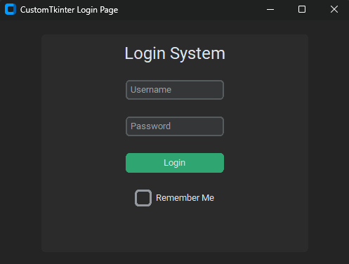
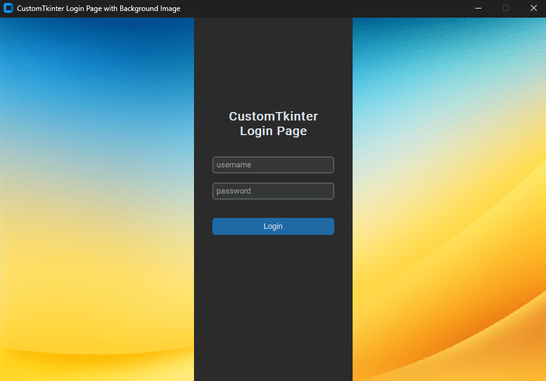
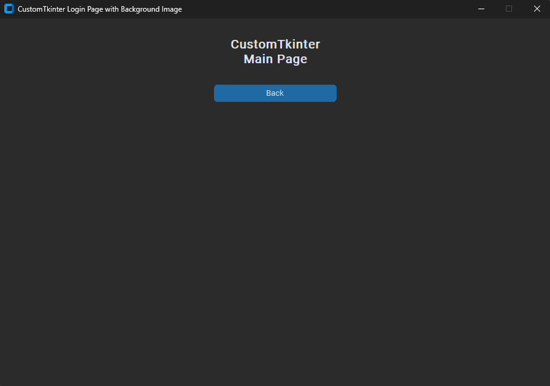

# 🔐 CTk Login App

A modern, clean, and lightweight **CustomTkinter Login Application** built with Python — available in two variants: a minimal login UI *without a background image* and an enhanced version *with a full-screen background image*. Designed for simplicity, responsiveness and professional UI design.


## ✨ Features

- 🎨 Modern UI using **CustomTkinter**
- 🌓 Supports **Light / Dark / System** themes
- 🖼 Includes a **background image** version
- 📦 Minimal clean version (no image)
- 🔐 Username & Password fields
- ⚡ Responsive and adaptive layout
- 🔧 Easy to customize and extend
- 💡 Beginner-friendly codebase


## 🧰 Installation Steps

### Step 1. Clone the repository

```bash
git clone https://github.com/iamx-ariful-islam/CTk-Login-App.git
cd CTk-Login-App
```

### Step 2. Install Python Dependencies

The `requirements.txt` file, lists of all the Python libraries that "**_ctk login app_**" depends on and installs those packages from the file:

```bash
pip install -r requirements.txt
# or (Linux/MacOS)
sudo pip install -r requirements.txt
```

### Step 3. Run the Application
```bash
python main.py
# or
python bg_main.py
```


## 📂 Folder Structure
Here’s the structure of the **CTk Login App** project:

```bash
CTk-Login-App/
│
├── image/
├── screenshots/
├── bg_main.py            # CTk Login App (with background image)
├── main.py               # CTk Login App (no background image)
├── LICENSE
├── README.md
└── requirments.txt
```


## 🖼️ Screenshots

Here are some screenshots of the `CTk Login App` project:

**Login Window**<br/>
<br/>
**Login Window - Background Image**<br/>
<br/>
**Main Window**<br/>



## 🤝 Contributing

Contributions, suggestions, and feedback are always welcome! ❤️<br/>
To contribute:

1. Fork the repository
1. Create a new branch (`feature/new-feature`)
1. Commit your changes
1. Push and submit a Pull Request

💬 You can also open an issue if you’d like to discuss a feature or report a bug.


## 🌐 For more or connect with me

<p align='center'>
  <a href="https://github.com/iam-ariful-islam"></a>&nbsp;&nbsp;&nbsp;&nbsp;
  <a href="https://twitter.com/am_ariful_islam"></a>&nbsp;&nbsp;&nbsp;&nbsp;
  <a href="https://bd.linkedin.com/in/im-ariful-islam"></a>&nbsp;&nbsp;&nbsp;&nbsp;
  <a href="https://www.facebook.com/jonakisoft.net/"></a>&nbsp;&nbsp;&nbsp;&nbsp;
</p>


## 📜 License

The [MIT](https://choosealicense.com/licenses/mit/) License (MIT)


<h2 align="center">💖 Thank You for Visiting!</h2>

<p align="center">
  “Good design is about making things simple yet significant”<br>
  — <a href="https://github.com/iamx-ariful-islam" target="_blank"><strong>Md. Ariful Islam</strong></a>
</p>
